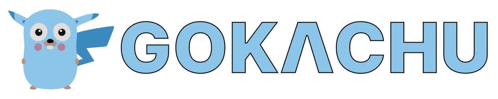

[](https://github.com/ksckaan1/gokachu/releases)

[](https://pkg.go.dev/github.com/ksckaan1/gokachu)
[](https://goreportcard.com/report/github.com/ksckaan1/gokachu)

[](https://github.com/ksckaan1/gokachu/graphs/contributors)
[](./LICENSE)

# 🚀 Gokachu

Gokachu is a powerful and easy-to-use in-memory cache library for Go. It provides a generic, thread-safe cache with Time-To-Live (TTL) support and a variety of cache replacement strategies.

## ✨ Features

- 🔒 **Thread-safe:** Can be safely used in concurrent applications.
- 🧬 **Generics support:** Store any type of data.
- ⏰ **TTL (Time-To-Live) support:** Automatically remove expired items.
- 🔄 **Cache Replacement Strategies:**
  - LRU (Least Recently Used)
  - MRU (Most Recently Used)
  - LFU (Least Frequently Used)
  - MFU (Most Frequently Used)
  - FIFO (First In First Out)
  - LIFO (Last In First Out)
  - None (no replacement)
- 🪝 **Hooks:** Execute custom functions on `Set`, `Get`, `Delete`, and `Miss` events.
- 🛠️ **Flexible API:** Rich set of methods for cache manipulation.

## 📦 Installation

```bash
go get -u github.com/ksckaan1/gokachu@latest
```

## 💻 Usage

### Basic Example

```go
package main

import (
	"fmt"
	"time"

	"github.com/ksckaan1/gokachu"
)

func main() {
	// Create a new cache with LRU replacement strategy.
	cache := gokachu.New[string, string](gokachu.Config{
		ReplacementStrategy: gokachu.ReplacementStrategyLRU,
		MaxRecordThreshold:  1000, // When it reaches 1000 records,
		ClearNum:            100,  // Clears 100 records.
	})
	defer cache.Close()

	// Set a value with a 30-minute TTL.
	cache.Set("my-key", "my-value", 30*time.Minute)

	// Get a value.
	value, found := cache.Get("my-key")
	if found {
		fmt.Println("Found:", value)
	} else {
		fmt.Println("Not found.")
	}

	// Delete a value.
	cache.Delete("my-key")
}
```

### ⚙️ Configuration

You can configure the cache using the `gokachu.Config` struct:

```go
config := gokachu.Config{
	ReplacementStrategy: gokachu.ReplacementStrategyLRU, // Eviction policy
	MaxRecordThreshold:  1000,                             // Max number of items in the cache
	ClearNum:            100,                              // Number of items to remove when the threshold is reached
	PollInterval:        1 * time.Second,                  // Interval to check for expired items
}
cache := gokachu.New[string, string](config)
```

### ⏱️ Working with TTL

You can set a TTL for each item in the cache. If the TTL is `0`, the item will not expire.

```go
// Set a value with a 5-minute TTL.
cache.Set("key1", "value1", 5*time.Minute)

// Set a value that never expires.
cache.Set("key2", "value2", 0)
```

### 🗂️ Cache Replacement Strategies

Gokachu supports the following cache replacement strategies:

- `ReplacementStrategyLRU`: Least Recently Used
- `ReplacementStrategyMRU`: Most Recently Used
- `ReplacementStrategyLFU`: Least Frequently Used
- `ReplacementStrategyMFU`: Most Frequently Used
- `ReplacementStrategyFIFO`: First In First Out
- `ReplacementStrategyLIFO`: Last In First Out
- `ReplacementStrategyNone`: No replacement (items are only removed when they expire)

You can set the replacement strategy in the configuration:

```go
cache := gokachu.New[string, string](gokachu.Config{
	ReplacementStrategy: gokachu.ReplacementStrategyLFU,
})
```

### 🪝 Using Hooks

You can add hooks to execute custom functions on cache events.

#### 🌐 Global Hooks
You can add hooks that apply to all items in the cache. The `Add...` methods return a `uint64` ID. This ID is optional but allows you to remove a specific hook later if you no longer need it to run.

```go
// Add a hook and save its ID
onSetId := cache.AddOnSetHook(func(key, value string, ttl time.Duration) {
    fmt.Printf("[HOOK] set -> %s with TTL %v\n", key, ttl)
})

cache.AddOnGetHook(func(key, value string) {
    fmt.Printf("[HOOK] get -> %s\n", key)
})

// ... add other hooks

// If you no longer need a hook, you can remove it using its ID.
removed := cache.RemoveOnSetHook(onSetId)
if removed {
    fmt.Println("OnSet hook was removed.")
}
```

The following methods are available for managing global hooks:
- `AddOnSetHook(hook func(key K, value V, ttl time.Duration)) uint64`
- `RemoveOnSetHook(id uint64) bool`
- `AddOnGetHook(hook func(key K, value V)) uint64`
- `RemoveOnGetHook(id uint64) bool`
- `AddOnDeleteHook(hook func(key K, value V)) uint64`
- `RemoveOnDeleteHook(id uint64) bool`
- `AddOnMissHook(hook func(key K)) uint64`
- `RemoveOnMissHook(id uint64) bool`


#### 🎯 Individual Hooks
You can also add hooks to individual items:
```go
cache.Set("my-key", "my-value", 0,
    gokachu.WithOnGetHook(func() {
        fmt.Println("Item retrieved!")
    }),
    gokachu.WithOnDeleteHook(func() {
        fmt.Println("Item deleted!")
    }))
```

### 🔧 Other Operations

Gokachu provides a rich set of methods for cache manipulation:

- `Delete(key K) bool`: Deletes a value from the cache. It returns `true` if the key existed and was deleted, otherwise `false`.
- `GetFunc(cb func(key K, value V) bool) (V, bool)`: Retrieves the first matching value.
- `DeleteFunc(cb func(key K, value V) bool) int`: Deletes values for which the callback returns true. It returns the number of deleted items.
- `Keys() []K`: Returns all keys in the cache.
- `KeysFunc(cb func(key K, value V) bool) []K`: Returns keys for which the callback returns true.
- `Count() int`: Returns the number of items in the cache.
- `CountFunc(cb func(key K, value V) bool) int`: Returns the number of items for which the callback returns true.
- `Flush() int`: Deletes all items from the cache.
- `Close()`: Closes the cache and all associated resources.

## 📊 Benchmark
```bash
go test -bench=. -benchmem -cpu=1,4,8 -count=1 ./...
goos: darwin
goarch: arm64
pkg: github.com/ksckaan1/gokachu
cpu: Apple M1
BenchmarkGokachu_Update          	65431836	        18.45 ns/op	       0 B/op	       0 allocs/op
BenchmarkGokachu_Update-4        	66597445	        18.27 ns/op	       0 B/op	       0 allocs/op
BenchmarkGokachu_Update-8        	66246644	        18.26 ns/op	       0 B/op	       0 allocs/op
BenchmarkGokachu_Get             	59910507	        18.88 ns/op	       0 B/op	       0 allocs/op
BenchmarkGokachu_Get-4           	60979225	        19.51 ns/op	       0 B/op	       0 allocs/op
BenchmarkGokachu_Get-8           	64043548	        18.88 ns/op	       0 B/op	       0 allocs/op
BenchmarkGokachu_InsertEvict     	 7994718	       150.8 ns/op	     112 B/op	       2 allocs/op
BenchmarkGokachu_InsertEvict-4   	 9672381	       121.8 ns/op	     112 B/op	       2 allocs/op
BenchmarkGokachu_InsertEvict-8   	 9836367	       122.3 ns/op	     112 B/op	       2 allocs/op
```

> [!NOTE]
> There are 2 allocs/op in the InsertEvict benchmark. Because the cache is full, it needs to evict an item before inserting a new one. This is expected behavior.
>
> Gokachu uses linked lists to maintain the order of items in the cache. And uses a map to store the key-value pairs. (linked list + map = 2 allocs/op)

## 🤝 Contributing

Contributions are welcome! Please feel free to submit a pull request or open an issue.

## 📄 License

This project is licensed under the MIT License - see the [LICENSE](./LICENSE) file for details.
